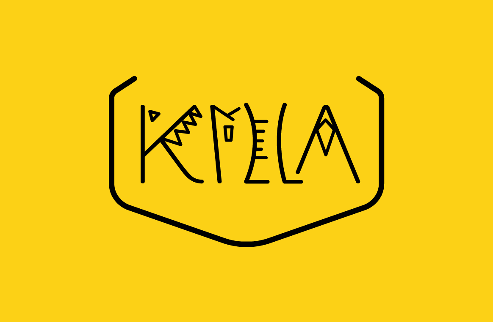
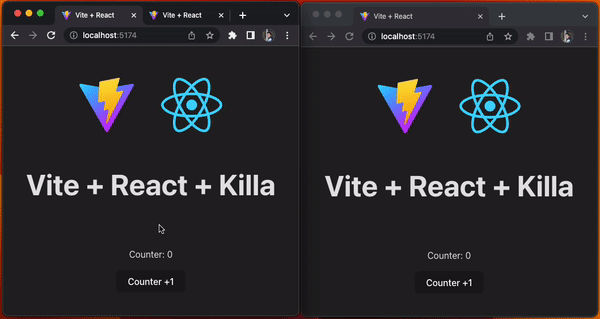

<p align="center">
  
</p>

# KILLA
Killa is a small and lightweight state management library for vanilla and React inspired by Zustand and SWR.

```bash
npm install killa
```

### Installing the vanilla version for Browser
To use directly vanilla minified version in the browser:

```html
<script src="https://unpkg.com/killa@1.5.1/dist/umd/killa.min.js"></script>
```

Or from jsdelivr:

```html
<script src="https://cdn.jsdelivr.net/npm/killa@1.5.1/dist/umd/killa.min.js"></script>
```

### How to create your first store

To create your first store you need to provide an object which will manage your state. **(The internal state is inmutable)**

```js

// ESM
import killa from 'killa'
// or
import { createStore } from 'killa'

// CJS
const killa = require('killa')
// or
const { createStore } = require('killa')

const store = killa({ counter: 0 })
// or
const store = createStore({ counter: 0 })
```

## Vanilla
### How to access to your store

```js
const store = killa({ counter: 0 })

store.getState() // { counter: 0 }
```

### How to update your store
```js
const store = killa({ counter: 0 })

store.setState(() => {
  return {
    counter: 1
  }
})

store.getState() // { counter: 1 }
```

### How to subscribe to state events

```js
const store = killa({ counter: 0 })

// This subscriber will be called every time any value of the state is updated.
// We could say that this would be a global subscriber.
store.subscribe((state, prevState) => {
  console.log('Updated state', state) // { counter: 1 }
  console.log('Previous state', prevState) // { counter: 0 }
})

store.setState(() => {
  return {
    counter: 1
  }
})

store.getState() // { counter: 1 }
```

But you can also subscribe to a specific event:

```js
const store = killa({ counter: 0, type: '', filter: '' })

// This subscriber will be called after updating the counter state.
store.subscribe((state, prevState) => {
  console.log('Updated state', state)
  // { counter: 1, type: '', filter: '' }
  console.log('Previous state', prevState)
  // { counter: 0, type: '', filter: '' }
}, (state) => state.counter)

// This subscriber will be called when the state of counter or filter is updated.
store.subscribe((state) => {
  console.log('Counter and filter state subscriber', state.counter)
}, (state) => ({ counter: state.counter, filter: state.filter }))

// This subscriber will not be called since the type state was not updated.
store.subscribe((state, prevState) => {
  console.log('Updated state', state)
  console.log('Previous state', prevState)
}, (state) => state.type)

store.setState((state) => {
  return {
    ...state,
    counter: state.counter + 1
  }
})

store.getState() // { counter: 1, type: '', filter: '' }
```

## React

```jsx
import killa, { useStore } from 'killa'

const store = killa({ counter: 0, type: '', filter: '' })

const Counter = () => {
  // This component will be rendered when counter or filter state changes
  const { state, setState } = useStore(store, (state) => {
    return {
      counter: state.counter,
      filter: state.filter
    }
  })

  const handleCounter = (e) => {
    setState((state) => {
      return {
        ...state,
        counter: state.counter + 1
      }
    })
  }

  return (
    <div>
      <p>Counter: {state.counter}</p>
      <button onClick={handleCounter}>
        Counter +1
      </button>
    </div>
  )
}
```

## Middlewares
To use directly vanilla minified version in the browser:

```html
<script src="https://unpkg.com/killa@1.5.1/dist/umd/killaMiddlewares.min.js"></script>
```

Or from jsdelivr:

```html
<script src="https://cdn.jsdelivr.net/npm/killa@1.5.1/dist/umd/killaMiddlewares.min.js"></script>
```

For vanilla, you can access to the middlewares using: `window.killaMiddlewares`
### Persist

Killa Persist uses `localStorage` by default.

```js
import { persist } from 'killa/persist'

const store = killa(
  { counter: 0, filter: '' },
  {
    use: [
      persist({ name: 'killa-persist' })
    ]
  }
)

store.getState() // { counter: 0 }
```


If you wish to use other storage you can do so by using the `normalizeStorage` method to normalize the storage supported by Killa Persist.

```js
import { persist, normalizeStorage } from 'killa/persist'

const store = killa(
  { counter: 0, filter: '' },
  {
    use: [
      persist({ name: 'killa-persist' }),
      storage: normalizeStorage(() => sessionStorage)
    ]
  }
)

store.getState() // { counter: 0 }
```

### Auto Revalidate



## Support
React >= 16.8, Chrome 58, Firefox 57, IE 11, Edge 18, Safari  11, & Node.js 12.
